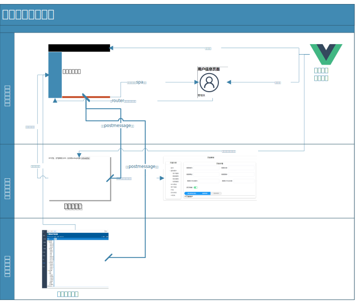

前端框架介绍
================

    2018-12-05
    赵中廷


## 一、框架的部署
### 1.1	下载安装
新建一个文件夹，从我们的git下下载最新的框架文件。
[在柳钢内网打开](http://172.16.4.191:3000/80822215/LG_fui.git)
```
git clone http://172.16.4.191:3000/80822215/LG_fui.git
```
[使用github仓库](https://github.com/zztdandan/LG_fui.git)
```
git clone https://github.com/zztdandan/LG_fui.git
```
进入目录后，切换到目前的正式版本分支:release(或者切换到已有的标签)
```
cd LG_fui
git fetch
git checkout release
```
安装依赖并测试运行
```
npm install
npm run dev
```
如果需要发布，则使用打包命令将其打包
```
npm run build
```
打包后的结果在/dist文件夹下。

###1.2	Nginx部署
编辑Nginx的nginx.conf文件，添加下面的段落：
```
    server {

        listen 8080;
        # 此处为监听端口
        server_name lg_ui.com;
        # 此处为名称
         location / {
              
            root D:/repo/LG_fui/lg-admin-fui/dist;
            #此处为build后生成的文件的地址
            index index.html;
            #此处为访问首页的文件名称
        }

        location ~ /api {
            #调用api的接口需做单独映射[注1]
            rewrite ^/api/(.*)$ /app/mock/17/$1 break;
            #前段是在工程里api网址的通配符，后段是目标网址中URN部分的通配符
            proxy_pass  http://172.16.4.194:8080;
            #这是后端接口的详细地址
            #以下是nginx反向代理外部地址的固定内容
            proxy_redirect     off;
            proxy_set_header   Host             $host;
            proxy_set_header   X-Real-IP        $remote_addr;
            proxy_set_header   X-Forwarded-For  $proxy_add_x_forwarded_for;
        }

    }
```
<font color=green>[注1]</font>在我们开发中，所有的api的访问地址都是/api/(.*)，在测试环境中，由于webpack的webpack-dev-server插件自带了一个小型的express进行映射，所以通过配置config.dev.ProxyTable:
```
 proxyTable: {
      '/api': { // api表示当前项目请求使用该项可进入远程端访问
        target: 'http://172.16.4.194:8080/app/mock/17', // 本地理服务器路径
        // target: 'http://140.143.26.135:3000', //远端 代理服务器路径
        pathRewrite: { '^/api': '/' }, // 重写路径
        changeOrigin: true
      }
```
可以实现映射api地址的目的。但是如果部署到正式环境中，则所有api访问的地址变成localhost:8080/api/(.*)，显然这个地址是没有任何东西的。所以我们除了要将dist输出目录映射到8080端口外，还需要特别地映射8080/api到我们api的地址（目前在该api挂的是个mock-server，地址是'http://172.16.4.194:8080/app/mock/17'，如果单机测试的话，你也可以将其挂载在某个iis服务或postman服务下）。

+ 注意，这个nginx的功能是是代替dev中的express存在的。所以我们也可以使用express或其他方式代理来进行部署。


## 二、框架结构
柳钢前端框架开发是一个支持多技术栈，多人协作开发的挂载式开发体系。每个开发人员可以拥有独立的页面工程，除了主工程外其他人可自选前端体系，只需注册到主页面即可。

柳钢前端框架结构图如下



## 三、各开发模式区别：

|各项特征|	在主框架主页面开发|	在主框架多页面开发|	在其他外链页面开发|
| --- | --- | --- |---|
|开发特征|	具有传统SPA开发的特征，使用完整的一套开发组件与包	|MPA开发特征，使用与主页面共享的一套开发组件与包。	|自选技术栈，较自由的开发模式|
|开发组件共享|	与主框架完全使用同样组件|	与主框架基本使用同样组件，在pages里面的组件不共享|	与主框架使用不同技术栈|
|资源共享	|可调用主框架的vuex|	用postmessage方式交互	|用postmessage方式交互|
|git	|如果主框架升级，需要合并大量代码并解决冲突|	如果主框架升级，需要合并极少的代码（个别配置文件），基本无冲突	|与主框架无关，不需要合并代码，主框架可以随时升级|
|资源加载|	所有资源打包在主项目的index.js中，较大	|主项目与分支项目打包不同的js但是共享第三方资源比如element-ui	|与主页面的资源分开加载，不共同使用|
|推荐	|单人维护前端项目时使用	|<=2人开发前端项目时使用	|多人同时负责前端项目，或没有专门前端开发人员时使用|

更详细的信息可以访问:[172.16.4.194:8081](http://172.16.4.194:8080)查看开发文档